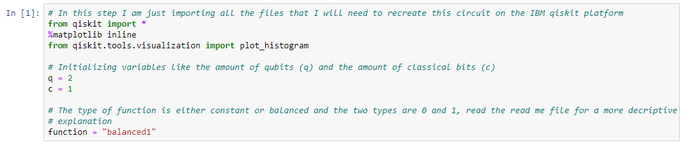
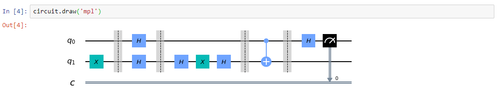

# Deutsch-Josza Algorithm
My goal with this repository is to describe one of the projects that I have been working out and successfully replicated call the Deutsch-Joza algorithm. This was one of the first projects that I worked on after starting my focus on quantum computers. The Deutsch-Jozsa algorithm is one of the most basic but genius examples leveraging quantum technology to manufacture a computational speed up. Using the IBM Qiskit interface, I was able to replicate the circuit that would be used to create the quantum speed up proposed by David Deutsch and Richard Jozsa in 1992. Within the article, I wrote about this project and how the math behind it works. I also went into depth about some quantum computational ideas like gates and how the quantum computers are actually speeding up the processes to display the ideas of supremacy.

On this page, I want to try to explain some of the logic I used to code this project.

# The Problem
In difficult terms to understand: We are given a function f, which takes in a string of bits as input and returns either a 0 or 1. For our example, we will be using a 2 qubit string and solving the following problem instead. 
### f({x0, x1, x2,...}) → 0 or 1 , where xn is 0 or 1
The guarentee of the function is that it is either balanced or constant where constant functions returns all 0's or all 1's for any input and the balanced function returns values of 0's and 1's based on the inputs. Our task is to determine wheather the function is balanced or constant.

For a more simple explanation: The projects focus is to solve a problem proposed by these two scientists that basically described a situation where there are two types of black box funcitons. With this in mind, your goal is to try to query the black box (this means you don't know what it does) function the least amount of times as possible and find out if the function is a balanced funciton or a constant function.

We need to find out whether the function is constant or balanced. A constant function has two subsets, a function in which no matter the input, the output is 1 or 0. The first type of constant function is the 1 function. If you put in a {1, 0}, you would receive a {1, 1}. The second type of constant function is the 0 function. If you put in a {1, 0}, you would receive a {0, 0}. A balanced function has two subsets as well, both of which depend on the input. The first type of balanced function is the identity function. If you put in a {1, 0}, you would receive a {1, 0}. Your outputs are the same values as your inputs. The second subset of balanced functions is the “NOT” function. If you put in a {1, 0}, you would receive a {0, 1}. Your outputs are the opposite values of your inputs.

## The Functions
In the case of my implimentation, I created specific names for each of these seperate cases. The constant case where the outputs are in the 0 state is created by the command constant0. The user can choose which case they want by just changing the function name at the top of the code to change the type of blackbox function. Depending on the type of function that is called, there are different gates that are applied to the circuit to replicate how this black box would normally react. The constant1 command for the operator function would replicate the constant function making the outputs a 1, the balanced0 command for the operator function woudl replicate the "NOT" function creating an output that is opposite to the input and the final balanced function which is the balanced1 function would just output the exact same values as the input. 

# Implimentation of The Algorithm
I recreated this circuit in the jupyter notebook program on my computer. We are going to be creating a quantum circuit on the IBM platform through [code](https://github.com/Aryaan962/deutsch-josza-algorithm/edit/master/Python%20Code) and simulate how it would act and give results. I will be showing the simulated results and the actual results if it were to run the code on a quantum computer.

## Block 1/6
So lets start with the first part which is just importing the files that we will need for this porject.
1. We will need qiskit because that is the software file that we will be using
2. %matplotlib is just a library of charts and diagrams we can use, this will make out circuits look better when we use the draw command
3. And finally the file that we will use to plot the histogram chart which we use when we are trying to visually analyze our results

Our next task is to decide how many qubits and bits we want to use for each register of out quantum circuit. For our example, we are replicating the most basic form of this algorithm which is a two qubit algorithm and a single bit just to have a place where we can store the measurement of our qubit once we are done.

The final component of this first block is deciding which type of function you want to try out. As I explained above and inside the comment there are four choices. Constant0, constant1, balanced0 and balanced1. You will notice later that every constant function has the same measured value for the first qubit (0) and every balanced function will also result in the same measured value for the first qubit (1).

## Block 2/6
This next component is the part where we actually initialize the circuit and create the black box function.

The first command we call is creating a variable and creating a quantum circuit inside with (q) qubits and (c) classical bits. At this point there are no gates on the circuit, it is all blank.

The second thing we do in this block of code is we create the operation function, also known as the blackbox function, which takes the perameter function in as input. This perameter is defined from the first block of code which helps this function determine which type of blackbox it will be testing out. Depending on which function you decide to add in, it will apply the gates accordingly. There are furthur more detailed explanations above every single line of code within the circuit so refer to that for more information.

## Block 3/6
This next block is the block where we start applying gates! The circuit.barrier() lines of code are basically just methods of making the circuit look clean. It creates the dividers in the circuit.

First we start off by flipping the last qubit (q[1]) from the state 0 to 1 then we apply a hadamard gate to both of the qubits. THen we apply the blackbox function, aka. the operation funciton and give it the parameter function which was defined in the first block. Once again, this is called the blackbox function because it the circuit does not know what it is and it does not matter what it is for the circuit to work.

Then we entangle the qubits using the CNOT gate from q[0] (target) to q[1] (control). All of this computation is happening in the hadamard basis as that is one of the first gates we applied to the qubits so then we apply the hadamard gate once again to the first qubit. Because it is a unitary gate, it will out the first qubit back into the 0, 1 state and we will be able to measure it and store it onto classical bit 0. This is done by the circuit.meeasure(0, 0).

## Block 4/6
This basically just draws out the circuit so far. The following images are the circuits of a constant case of the blackbox and a balanced case of the black box respectively. Try to understand it yourself before you see the results!

 
